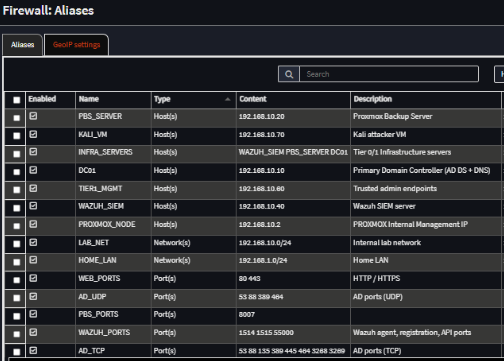

# Firewall Architecture

## Purpose

The firewall architecture defines the trust boundaries, traffic enforcement model, and network segmentation controls for the Enterprise Security Homelab.

OPNsense functions as the centralized Policy Enforcement Point (PEP).  
No inter-network communication bypasses this control layer.

The objective is to:

- Enforce tier boundaries
- Restrict lateral movement
- Control administrative access paths
- Support centralized monitoring
- Maintain a default-deny posture

---

## Enforcement Model

All traffic between:

- Home LAN (Management Network)
- Internal Enterprise Network
- Attack Simulation Zone

is routed through OPNsense.

There is no direct routing between segments outside of firewall inspection.

The firewall is responsible for:

- North/South traffic inspection (internet egress)
- East/West segmentation enforcement
- Tier-based access restrictions
- Telemetry flow control to the SIEM

---

## Network Zones

### Management Network (vmbr0 – 192.168.1.0/24)

- Hosts Proxmox management interface
- Serves as upstream internet gateway
- Considered external relative to the lab network
- No implicit trust into internal systems

---

### Internal Enterprise Network (vmbr1 – 192.168.10.0/24)

- Hosts all domain infrastructure
- Enforces Active Directory tiering model
- Subject to explicit allow rules
- Default deny behavior enforced

---

### Adversary Simulation Zone

- Contains Kali attack host
- Segmented from identity infrastructure
- Traffic intentionally constrained for testing containment controls

---

## Firewall Rule Philosophy

Rules are built using the following principles:

### 1. Default Deny

Traffic is blocked unless explicitly permitted.

Explicit block rules are used to prevent unintended lateral movement.

---

### 2. Least Privilege

Rules allow only:

- Required source hosts
- Required destination hosts
- Required ports
- Required protocols

Broad “any-any” rules are not used.

---

### 3. Tier Boundary Enforcement

Lower-tier systems cannot initiate connections to higher-tier systems unless operationally required.

Examples:

- Tier 2 → Tier 0 is restricted
- Client-to-client communication is blocked
- Administrative systems are isolated from user endpoints

---

### 4. Alias-Based Rule Design

Aliases are used to:

- Improve readability
- Simplify rule management
- Reduce configuration errors
- Support future scaling

Aliases are categorized by:

- Network
- Host
- Port group

This approach improves maintainability as the environment evolves.

---

## Controlled Traffic Flows

### Identity Services

Domain members are permitted to communicate with DC01 for:

- Kerberos
- LDAP
- DNS
- Authentication services

Only required Active Directory ports are allowed.

---

### Administrative Access

Tier 1 administrative workstation is permitted:

- RDP / SSH to member servers
- Access to backup infrastructure
- Access to monitoring systems

Tier 0 administration is restricted to PAWs.

---

### Security Monitoring

All systems are permitted to send telemetry to the Wazuh SIEM.

Logging traffic:

- Is explicitly allowed
- Is restricted to defined ports
- Does not grant reverse management access

---

### Backup Operations

Proxmox and PBS communication is restricted to defined infrastructure hosts.

Backup infrastructure does not initiate broad client communication.

---

### Attack Simulation

The Kali host:

- Is prevented from unrestricted lateral movement
- Cannot directly access identity infrastructure without explicit rule
- Is used to validate containment and detection capabilities

---

## Lateral Movement Controls

Firewall policy explicitly prevents:

- Client-to-client communication
- Client-to-administrative workstation access
- Client-to-Tier 0 infrastructure access

These controls complement Active Directory permissions and reduce credential theft risk.

---

## Security Benefits

This architecture provides:

- Clear blast-radius containment
- Measurable segmentation
- Reduced attack surface
- Improved detection signal quality
- Enterprise-aligned enforcement model

---

## Evidence

