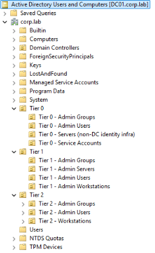
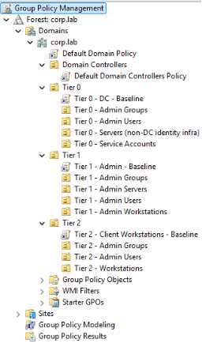

# Active Directory Design & Tiered Administration

## Objective
This document describes the Active Directory design implemented in the enterprise-homelab environment.  
The goal is to establish a secure, scalable identity infrastructure that enforces administrative boundaries, reduces credential exposure, and supports centralized policy management.

The design is modeled after Microsoft's tiered administrative model commonly used in enterprise environments.

## Domain Overview
- **Domain Name:** corp.lab
- **Domain Controller:** DC01
- **Roles:**
  - Active Directory Domain Services
  - AD-integrated DNS
  - Group Policy management

DC01 is treated as Tier 0 infrastructure and protected accordingly.

## Tiered Administration Model

### Tier 0 – Identity & Control Plane
Tier 0 contains the most sensitive identity systems and accounts.

**Includes:**
- Domain Controllers
- AD-integrated DNS
- Group Policy infrastructure

**Controls:**
- Only Tier 0 administrative accounts may access Tier 0 systems
- No internet access
- Restricted administrative logon locations

### Tier 1 – Administrative Systems
Tier 1 contains systems and accounts used to manage servers and infrastructure.

**Includes:**
- Administrative workstations
- Server administration accounts

**Controls:**
- Tier 1 accounts may administer Tier 1 systems
- Tier 1 systems may access Tier 0 services for management
- Tier 1 accounts are denied interactive logon to Tier 2 systems

### Tier 2 – Client Systems
Tier 2 contains standard user systems and non-privileged accounts.

**Includes:**
- Domain-joined client workstations
- Standard user accounts

**Controls:**
- No administrative access to Tier 0 or Tier 1 systems
- Restricted lateral movement
- Limited privilege assignments

## Organizational Unit (OU) Structure
The Active Directory OU hierarchy is organized by tier and function rather than by user or computer type.

The screenshot above shows the tiered Organizational Unit (OU) layout as implemented in Active Directory Users and Computers (ADUC).

The screenshot above illustrates the tiered OU layout and associated baseline Group Policy Objects (GPOs) as implemented in Group Policy Management Console (GPMC).

corp.lab
├── Tier 0
│ ├── Tier 0 - Admin Groups
│ ├── Tier 0 - Admin Users
│ ├── Tier 0 - Servers (non-DC identity infra)
│ └── Tier 0 - Service Accounts
├── Tier 1
│ ├── Tier 1 - Admin Groups
│ ├── Tier 1 - Admin Servers
│ ├── Tier 1 - Admin Users
│ └── Tier 1 - Admin Workstations
├── Tier 2
│ ├── Tier 2 - Admin Groups
│ ├── Tier 2 - Admin Users
│ └── Tier 2 - Workstations
└── Users

This structure simplifies policy application and prevents accidental privilege inheritance.

## Group Policy Strategy

### Baseline Policies
Baseline Group Policy Objects (GPOs) are applied at each tier level.

**Tier 0 Baseline**
- Hardened security settings
- Restricted logon rights
- No user-level browsing
- Limited service exposure

**Tier 1 Baseline**
- Administrative workstation hardening
- Credential protection
- Restricted administrative delegation

**Tier 2 Baseline**
- Client workstation security baselines
- User privilege restrictions
- Endpoint protection configuration

### GPO Design Principles
- One purpose per GPO
- Clear naming conventions
- Linked at the highest appropriate OU level
- Enforced only where necessary

## Administrative Access Controls
Administrative access is controlled using a combination of:
- Tier-specific admin groups
- Logon restrictions
- Group Policy user rights assignments
- Network-level firewall enforcement

Administrators must use Tier 1 administrative workstations to manage Tier 0 systems, reducing credential exposure on lower-trust endpoints.

## Service Accounts
Service accounts are:
- Placed in dedicated OUs
- Scoped to least privilege
- Used only where required

## Security Benefits
This Active Directory design provides:
- Reduced credential exposure
- Clear administrative boundaries
- Strong defense against lateral movement
- Easier incident containment
- Enterprise-aligned identity controls
