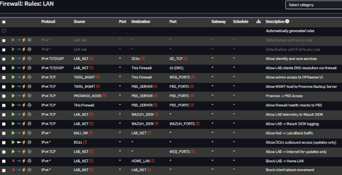

# Networking & Traffic Control

## Objective
This document describes the network security model used in the enterprise-homelab environment.  
The objective is to enforce clear trust boundaries, restrict lateral movement, and support centralized monitoring while maintaining functional administrative access.

## Network Architecture Overview
The following diagram illustrates the logical network layout, trust boundaries, and traffic enforcement points used in Phase 1.

All network segmentation and traffic controls described below map directly to this architecture.

## Firewall Platform
- **Firewall:** OPNsense
- **Role:** Central routing and security enforcement point
- **Responsibilities:**
  - Routing between the internal lab network and the home network
  - Internet egress control
  - East/west traffic inspection
  - Tier-based access enforcement

All inter-network communication traverses the firewall.

## Network Zones

### Home Network
- Considered untrusted relative to the lab environment
- No direct access into internal lab systems
- Used solely as an upstream internet connection

### Internal Lab Network
- Hosts all enterprise lab infrastructure
- Protected by explicit allow rules and default-deny behavior
- Lateral movement is intentionally restricted

## Firewall Rule Philosophy
Firewall rules are designed according to the following principles:

- **Default Deny**
  - Traffic is blocked unless explicitly permitted
- **Least Privilege**
  - Rules allow only required ports, protocols, and source/destination pairs
- **Explicit Trust Boundaries**
  - Tier 0 systems are protected from lower-tier access
- **Readability & Maintainability**
  - Network and service aliases are used extensively to reduce complexity

Firewall rules are evaluated on a first-match basis, with explicit deny rules placed last to enforce default-deny behavior.

## Alias-Based Rule Design
Aliases are used to simplify rule management and improve clarity.
Aliases are categorized by function (network, host, and port group) to ensure rules remain readable and auditable.

### Network Aliases
- LAB_NET
- HOME_LAN

### Host Aliases
- DC01
- WAZUH_SIEM
- PBS_SERVER

### Port Group Aliases
- AD_TCP
- AD_UDP
- WAZUH_PORTS
- WEB_PORTS

This approach keeps firewall rules readable and scalable as the environment grows.

## Key Traffic Flows

### Identity Services
- Clients and servers are permitted to communicate with **DC01** for:
  - Authentication
  - Directory services
  - DNS resolution
- Only required Active Directory ports are allowed

### Administrative Access
- **Tier 1 administrative workstations** are permitted access to:
  - Tier 0 infrastructure (DC01)
  - Management services (Proxmox, backup systems)
- Administrative access from lower-tier systems is explicitly denied

### Client Behavior
- Tier 2 clients:
  - Can authenticate to the domain
  - Can reach the internet for updates
  - Are restricted from lateral movement
  - Cannot access administrative infrastructure

### Security Monitoring
- All systems are permitted to send telemetry to the **Wazuh SIEM**
- Logging traffic is one-directional where possible
- SIEM-initiated access back to clients is restricted

### Backup Operations
- Backup traffic is restricted to:
  - Proxmox hosts
  - Backup infrastructure
- Backup systems do not initiate connections to client endpoints

### Attack Simulation
- Kali Linux is isolated from sensitive infrastructure
- Attack traffic is intentionally constrained via firewall rules
- Used only for controlled testing and validation

## Lateral Movement Controls
Firewall rules explicitly prevent:
- Client-to-client communication
- Client-to-administrative workstation access
- Client-to-Tier 0 infrastructure access

These controls provide a strong network-based security layer in addition to Active Directory permissions.

## Internet Egress Controls
- Only approved systems are allowed outbound internet access
- Client internet access is restricted to required services
- Infrastructure systems have tightly scoped outbound permissions

## Security Benefits
This networking model provides:
- Reduced attack surface
- Clear blast-radius containment
- Improved detection fidelity
- Easier incident scoping
- Enterprise-aligned security controls

## Future Enhancements
Planned improvements include:
- Additional VLANs for tier separation
- IDS/IPS tuning
- Egress filtering based on application identity
- Enhanced logging of denied traffic

## Firewall Rule Enforcement Evidence

