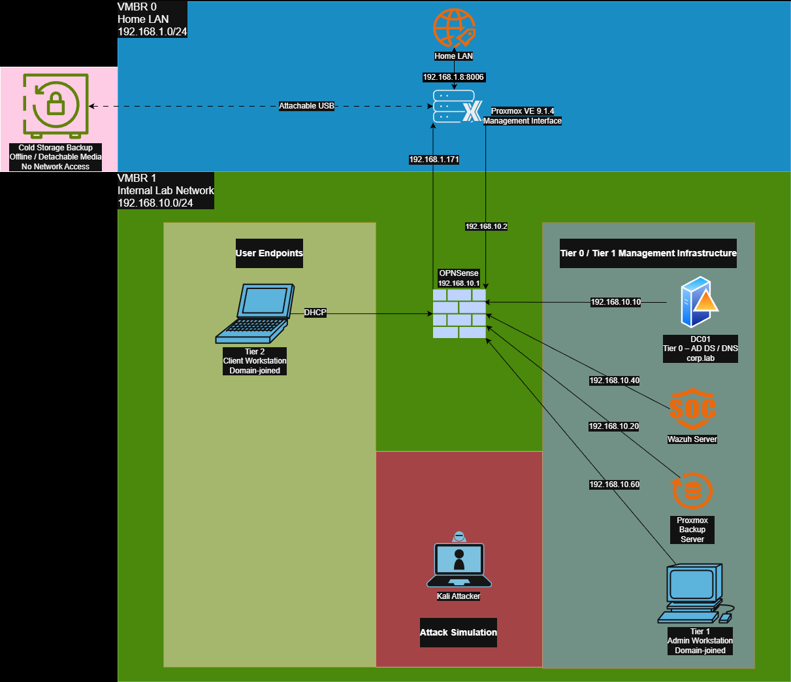

# Phase 1 – Core Infrastructure Overview

## Objective
The goal of Phase 1 is to establish a stable, secure, and well-documented enterprise-style foundation to support future security monitoring, detection engineering, and attack simulation.

This phase focuses on core identity services, network segmentation, administrative boundaries, and supporting infrastructure rather than detection logic or automation.

## Network Architecture

The following diagram illustrates the overall network segmentation, trust boundaries, and tiered infrastructure design used throughout Phase 1.

## Environment Summary
The homelab is built on Proxmox Virtual Environment and segmented using OPNsense as the central routing and security enforcement point. All systems are deployed with intentional role separation and aligned to a tiered Active Directory security model.

The environment is designed to resemble a small enterprise network rather than a flat or convenience-driven lab.

## Core Components

### Virtualization Platform
- **Proxmox Virtual Environment 9.1.4**
- Hosts all lab virtual machines
- Uses dedicated virtual bridges for network separation
- Integrated with centralized backup infrastructure

### Network & Security
- **OPNsense Firewall**
  - Serves as the single routing and security control point
  - Separates the internal lab network from the home network
  - Enforces east/west traffic restrictions
  - Uses aliases to simplify firewall rule management

### Identity & Access Management (Tier 0)
- **DC01**
  - Active Directory Domain Services
  - AD-integrated DNS
  - Group Policy management
- Implements a tiered administrative model to reduce credential exposure

### Administrative Systems (Tier 1)
- **WIN11-Admin01**
  - Dedicated administrative workstation
  - Used for domain administration, Group Policy, and infrastructure management
  - Restricted access to Tier 0 assets

### Client Systems (Tier 2)
- **WIN11-Client01**
  - Standard domain-joined workstation
  - Represents typical end-user activity
  - Generates authentication and endpoint telemetry

### Security Monitoring
- **Wazuh SIEM**
  - Centralized log collection and analysis
  - Receives telemetry from servers, clients, and infrastructure
  - Forms the foundation for future detection engineering

### Backup & Recovery
- **Proxmox Backup Server**
  - Provides centralized backups of lab systems
  - Supports recovery testing and resilience validation
- **Cold Storage Backup**
  - Represents offline or detached backup storage
  - Designed to protect against ransomware or destructive events

### Attack Simulation
- **Kali Linux**
  - Isolated attack platform
  - Used for controlled adversary simulation
  - Network access restricted via firewall rules

## Security Design Principles
Phase 1 is built around the following principles:

- **Network Segmentation**
  - Clear separation between home network and lab environment
  - Controlled routing through a central firewall

- **Tiered Administration**
  - Separation of Tier 0, Tier 1, and Tier 2 systems
  - Reduced credential exposure and blast radius

- **Least Privilege**
  - Explicit firewall rules
  - Restricted lateral movement
  - Role-based access

- **Observability**
  - Centralized logging from the start
  - Stable identifiers (static IPs, hostnames) for correlation

## Current Status
- Core infrastructure deployed and operational
- Network segmentation enforced
- Active Directory and Group Policy structure in place
- Centralized logging established
- Backup and recovery capabilities implemented

## Next Phase Preview
Phase 2 will build on this foundation by:
- Expanding log ingestion
- Implementing Windows Event Forwarding
- Enhancing SIEM detections
- Validating visibility through controlled attack scenarios
