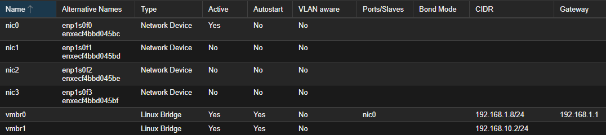

# Virtualization Platform Design

## Objective
This document describes the virtualization platform used to host the enterprise-homelab environment.  
The goal is to provide a stable, secure, and scalable foundation that supports segmentation, backup, and repeatable system deployment.

The virtualization layer is intentionally designed to resemble small-to-medium enterprise infrastructure rather than a flat or convenience-driven lab.

## Hypervisor Platform
- **Platform:** Proxmox Virtual Environment
- **Version:** 9.1.4
- **Role:** Central virtualization and management platform

Proxmox is used to host all infrastructure, security, and client systems in the lab.

## Virtual Machine Organization
Virtual machines are named and organized by function to improve clarity and manageability.

**Key virtual machines include:**
- OPNsense (Firewall)
- DC01 (Domain Controller)
- WIN11-Admin01 (Tier 1 Admin Workstation)
- WIN11-Client01 (Tier 2 Client)
- Wazuh Server (SIEM)
- Kali Linux (Attack Simulation)
- Proxmox Backup Server

This naming convention simplifies monitoring, logging, and administrative workflows.

## Network Integration
The Proxmox management interface resides on the home network and does not bypass firewall enforcement for internal lab traffic.

Proxmox virtual bridges are used to support network segmentation.

- **vmbr0**
  - Home LAN (192.168.1.0/24)
  - Hosts Proxmox management interface
- **vmbr1**
  - Internal lab network (192.168.10.0/24)
  - Connected to OPNsense LAN interface

No virtual machines bypass the firewall; all traffic is routed through OPNsense.

## Proxmox Network Bridge Configuration

The following screenshot provides evidence of the Proxmox network bridge layout used to enforce separation between management access and internal lab traffic.

The Proxmox management interface resides on **vmbr0 (Home LAN)**, while **vmbr1** is dedicated to internal lab traffic and is subject to OPNsense firewall enforcement.

This design ensures that hypervisor management access is isolated from internal lab workloads and governed by explicit firewall policy.
